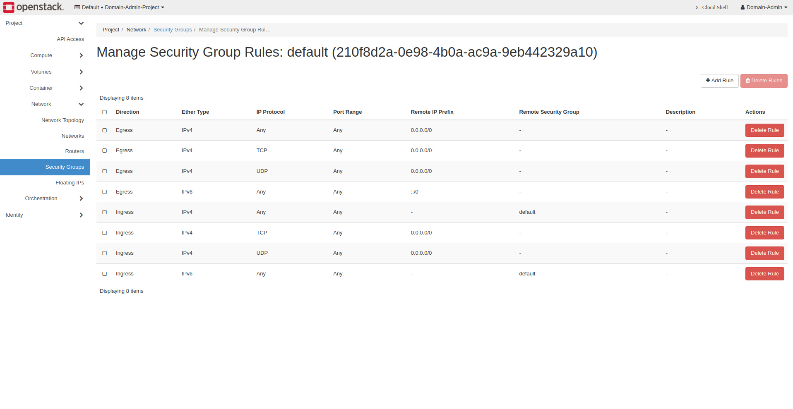
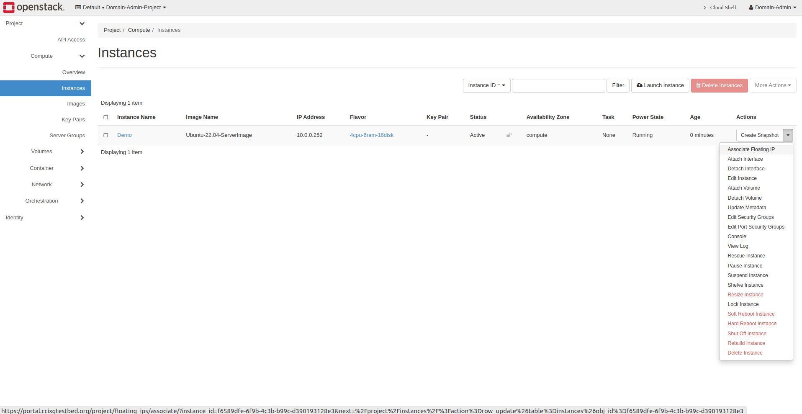
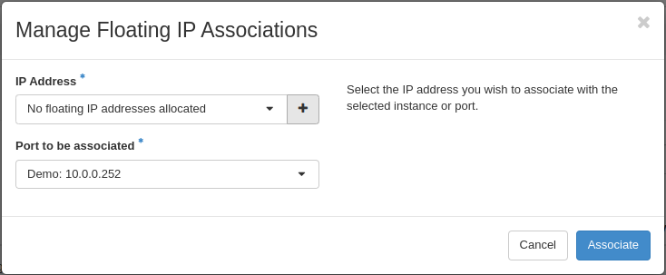
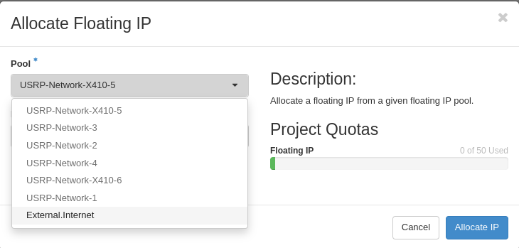
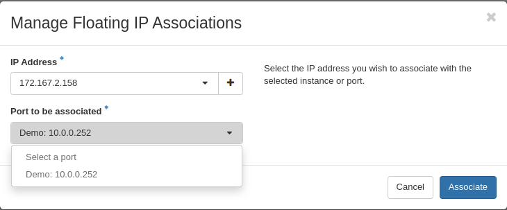
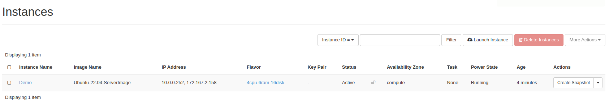

Launching OpenStack Instances
=============================================================

This documentation provides steps to create and launch OpenStack instances with USRP (Universal Software Radio Peripheral) access using the Command-Line Interface (CLI) and generic compute VMs through the OpenStack dashboard.

Keywords: USRP, Instance, OpenStack, CLI, Dashboard, Compute VM, Cloud Computing

.. note::
    - Each USRP can only be connected to one instance at a time.
    - Users cannot create an instance with a USRP network unless granted access by an OpenStack admin.
    - This guide is intended for users on Linux, macOS, and Windows devices.

To create an OpenStack instance with **USRP access** using the Command-Line Interface (CLI), follow the steps below:

1. **Download Your OpenStack RC File**

   - Log in to the OpenStack portal: `Link <https://portal.ccixgtestbed.org/auth/login>`_.
   - Download your profile's RC file from the drop-down in the top-right corner.

   .. image:: _static/rc_file.gif
      :align: center

2. **Install Necessary Dependencies**

   **For Linux/macOS:**

   Ensure Python 3 and the required dependencies are installed by following these steps:

   .. code-block:: bash

       sudo apt update
       sudo apt install -y python3-pip python3-dev
       sudo pip3 install --upgrade pip
       sudo pip3 install python-openstackclient

   **For Windows:**

   Follow these steps to install Python 3 and pip, and then the OpenStack CLI tool:

   - **Install Python 3:**  
     Download and install Python from the official Python website <https://www.python.org>_. During installation, ensure to check the box for **"Add Python to PATH"**.

   - **Install pip:**  
     After Python is installed, pip (the Python package installer) should be installed automatically. You can verify this by running the following commands in Command Prompt (CMD):

     .. code-block:: bash

         python --version
         pip --version

   - **Upgrade pip:**  
     To upgrade pip, open Command Prompt (CMD) and run:

     .. code-block:: bash

         python -m pip install --upgrade pip

   - **Install OpenStack Client:**  
     Once pip is upgraded, you can install the OpenStack CLI tool:

     .. code-block:: bash

         pip install python-openstackclient

     After installation, you can use the OpenStack CLI by typing openstack in Command Prompt or PowerShell.

3. **Source the OpenStack RC File**

   Navigate to the directory where you downloaded the RC file and source it:

   .. code-block:: bash

       . <rc_file_name>.sh

   This command will prompt you to enter your OpenStack password.

    .. image:: _static/rc_file_command_2.png
        :align: center
        :width: 550px

.. 4. **Create an Instance with USRP Access**
Create an Instance with USRP Access
=============================================================

CLI Instructions for Compute
^^^^^^^^^^^^^^^^^^^^^^^^^^^^^^^^

   Use the following command to create an instance with compute access:

   .. code-block:: bash

       openstack --insecure server create --flavor <flavor_name> --image <image_name> --nic net-id=<internal_network_id> --availability-zone compute <instance_name>

CLI Instructions for Radio
^^^^^^^^^^^^^^^^^^^^^^^^^^^^^^^^

   Use the following command to create an instance with USRP access:

   .. code-block:: bash

       openstack --insecure server create --flavor <flavor_name> --image <image_name> --nic port-id=$(openstack --insecure port list | grep USRP-<usrp_number> | awk '{print $2}') --nic net-id=<internal_network_id> --availability-zone radio --user-data <file_name> <instance_name>
    
CLI Instructions for GPU
^^^^^^^^^^^^^^^^^^^^^^^^^^^^^^^^

   Use the following command to create an instance with GPU access:

   .. code-block:: bash

       openstack --insecure server create --flavor <flavor_name> --image <image_name> --nic net-id=<internal_network_id> --availability-zone gpu <instance_name>
   **Note**: Replace <flavor_name>, <image_name>, <usrp_number>, <internal_network_id>, and <instance_name> with the appropriate values.

   For further details, watch the tutorial video: https://youtu.be/NtC79iuUNNI

.. 5. **Configure the USRP Network Interface Inside the Instance**
Configure the USRP Network Interface Inside the Instance
========================================================

   After creating the instance, follow these steps to configure the USRP network interface:

   a. **Check Network Interfaces**

      Open a terminal in your instance and run:

      .. code-block:: bash

          ip a

      Look for the interfaces:

      - **ens3**: Always present and has an internal network IP (``10.0.0.0/24``).
      - **USRP Interface**: An additional interface (e.g., **ens5**, **ens7**), which is connected to the USRP device.

   b. **Edit Netplan Configuration**

      Open the netplan configuration file:

      .. code-block:: bash

          sudo nano /etc/netplan/<press Tab to autocomplete the filename>

      You may be prompted for your password.

    c. **Configure the USRP Interface**

      In the netplan configuration file:

      - Set ``dhcp4: false`` for the USRP interface.
      - Add a static IP address for the USRP interface.
      - The IP address should match the USRP network address, which can be seen after creating the instance in the dashboard.
      - Choose an IP address in the range ``192.168.<USRP_SUBNET>.<4-10>/24``.

      Example configuration:

      .. code-block:: yaml

          network:
            version: 2
            renderer: networkd
            ethernets:
              ens5:
                dhcp4: false
                addresses:
                  - 192.168.<USRP_SUBNET>.<INSTANCE_IP>/24
                mtu: 9000

      **Notes**:

      - Replace ``<USRP_SUBNET>`` with the specific subnet number assigned to your USRP device (between 101 and 172). This number can be found in the OpenStack dashboard under your instance's network details.
      - Replace ``<INSTANCE_IP>`` with an IP address between ``4`` and ``10``.
      - The USRP device's IP address is always ``192.168.<USRP_SUBNET>.2``.

   d. **Apply Network Configuration**

      Save the file and exit the editor (Ctrl+O to save, Ctrl+X to exit in nano). Then apply the changes:

      .. code-block:: bash

          sudo netplan apply

   e. **Verify USRP Connectivity**

      - The USRP IP address always ends with ``.2`` (e.g., ``192.168.101.2``).
      - Ping the USRP device to verify connectivity:

        .. code-block:: bash

            ping 192.168.<USRP_SUBNET>.2

      - Use the following command to find the USRP device:

        .. code-block:: bash

            uhd_find_devices --args="addr=192.168.<USRP_SUBNET>.2"

      Verify that the output displays information about the connected USRP device.

   **Note**: If you encounter any issues, ensure that your USRP device is properly connected and that the IP addresses are correctly configured.

Create OpenStack Network
========================

To create a network in OpenStack, follow these steps:

1. **Log in to the OpenStack Dashboard**

   - Open a web browser and navigate to the OpenStack dashboard URL.
   - Enter your **Username**, **Password**, and **Domain Name**.
   - Click **Sign In**.

2. **Navigate to the Network Section**

   - On the left-hand side, under the **Project** section, click on the **Network** tab.
   - In the drop-down menu, select **Networks**.

3. **Create a New Network**

   - Click on the **Create Network** button.

   - In the **Create Network** dialog, provide the following details:

     - **Name**: Enter a name for the network (e.g., ``Internal/External-Network-Username``).
     - **Description**: *(Optional)* Provide a brief description of the network.
     - **Provider Network**: Leave as default for a regular tenant network.
     - **Admin State**: Ensure the admin state is set to **Up**.

   - Click **Create** to create the network.

4. **Create a Subnet for the Network**

   1. **Navigate to the Subnets Section**

      - After creating the network, navigate to the **Subnets** tab under the **Network** section.

   2. **Click the Create Subnet Button**

      - Click the **Create Subnet** button.

   3. **Provide Subnet Details**

      - In the **Create Subnet** dialog, provide the following details:

        - **Name**: Enter a name for the subnet (e.g., ``Internal/External-Subnet-Username``).
        - **IP Version**: Choose the IP version IPv4 based on your requirements.
        - **CIDR**: Enter the IP address range in CIDR notation (e.g., ``10.0.0.0/24``).
        - **Gateway**: *(Optional)* Enter the gateway IP address for the subnet.
        - **Allocation Pools**: *(Optional)* Define a range of IP addresses to allocate from.
        - **DNS Nameservers**: *(Optional)* Enter DNS nameservers if required.
        - **Host Routes**: *(Optional)* Define any host routes for the subnet.

   4. **Create the Subnet**

      - Click **Create** to create the subnet.

5. **Create a Router (Optional)**

   If you need to connect your network to an external network or provide internet access, you may need to create a router:

   - Navigate to the **Routers** tab under the **Network** section.
   - Click the **Create Router** button.

   - In the **Create Router** dialog, provide the following details:

     - **Name**: Enter a name for the router (e.g., ``Internal/External-Router-Username``).
     - **Description**: *(Optional)* Provide a brief description of the router.
     - **Admin State**: Ensure the admin state is set to **Up**.

   - Click **Create** to create the router.

   - **Attach the Router to the Network**:

     1. Select the router from the list and click on it to open the details page.
     2. Navigate to the **Interfaces** tab and click **Add Interface**.
     3. Select the subnet you created and click **Add**.

6. **Verify Network Configuration**

   - Return to the **Networks** tab and ensure your new network appears in the list.
   - Verify the associated subnet is listed under the **Subnets** tab.
   - Confirm the router is correctly configured and attached if required.

For a step-by-step walkthrough, watch the tutorial video below:

.. raw:: html

   

     <video width="640" height="480" controls>
       <source src="_static/create_network.webm" type="video/webm">
       Your browser does not support the video tag.
     </video>
   

Verifying Security Groups in OpenStack
======================================

To verify and configure security groups in OpenStack, follow these steps:

1. **Navigate to the Security Groups Section**

   - On the left-hand side, under the **Project** section, click on the **Network** tab.
   - In the drop-down menu, select **Security Groups**.

2. **Select Your Security Group**

   - You will see a list of security groups associated with your project.
   - Click on the **Security Group** assigned to your instances.

3. **Review the Security Group Rules**

   Ensure the following rules are present:

   **Ingress Rules** *(incoming traffic)*:

   - **Protocol**: TCP
   - **Direction**: Ingress
   - **Port Range**: *(Specify port ranges or use "All TCP" to allow all ports)*
   - **Protocol**: UDP
   - **Direction**: Ingress
   - **Port Range**: *(Specify port ranges or use "All UDP" to allow all ports)*

   **Egress Rules** *(outgoing traffic)*:

   - **Protocol**: TCP
   - **Direction**: Egress
   - **Port Range**: *(Allow all or specify the range)*
   - **Protocol**: UDP
   - **Direction**: Egress
   - **Port Range**: *(Allow all or specify the range)*

4. **Modify Security Group Rules if Necessary**

   - If these rules are not present or incorrectly configured, add or modify them:
     - Click **Add Rule**.
     - Select the appropriate protocol, direction, and port ranges to allow TCP and UDP ingress/egress.

5. **Save Changes**

   - After making any changes, ensure you **Save** them.

Creating and Associating a Floating IP in OpenStack
===================================================

Follow these steps to create and associate a floating IP:

1. **Navigate to the Floating IPs Section**

   - Navigate to the **Project** section and select the **Network** tab.
   - Click on **Floating IPs** to view and manage floating IP addresses.

2. **Allocate a Floating IP**

   - Click on the **Allocate IP** button.
   - In the allocation settings, select the **External Network** from the drop-down menu (this is the network that provides public IP addresses).

3. **Confirm IP Range**

   - Ensure that the allocated Floating IP starts with **172.167.X.X**. This is the specific range you require.

4. **Associate the Floating IP**

   - Click on the **Associate IP** button.
   - Choose the **Floating IP** you just allocated.
   - In the association settings:
     - Select your internal private network (the network you want to connect the Floating IP to).
     - Specify the **instance** (or VM) to which the Floating IP should be associated.

5. **Save the Changes**

   - Ensure you save the configuration to apply the changes.

6. **Verify the Association**

   - Confirm that the Floating IP is correctly associated with the internal private network.
   - The Floating IP should be visible under the **Floating IPs** section with the correct IP range.

Dashboard Instructions for Compute VM Access
=============================================================

To create a **compute VM** using the **OpenStack dashboard**, follow these steps:

1. **Log in to the OpenStack Dashboard**

   - Access the OpenStack portal: `Link <https://portal.ccixgtestbed.org/auth/login>`_.

   .. image:: _static/instance-1.png
        :align: center
        :width: 650px

   - Navigate to the "Launch Instance" screen under the project section.

2. **Configure Instance Settings**

   - Provide a name for the instance.
   - Select compute as the availability zone (for generic VMs, not radio).
   
   .. image:: _static/instance-2.png
        :align: center
        :width: 650px

3. **Select Boot Source**

   - In the "Source" tab, select the appropriate boot source (e.g., an image or snapshot).
   - Set "Create New Volume" to "Yes" or "No" depending on your requirements.
   - Choose the boot source (e.g., Ubuntu-18.04-ServerImage).

   .. image:: _static/instance-3.png
        :align: center
        :width: 650px

4. **Select Flavor**

   - Choose the flavor according to the VM's resource requirements (vCPUs, RAM, disk size).

   .. image:: _static/instance-4.png
        :align: center
        :width: 650px

5. **Select Network**

   - Choose the appropriate network for your instance.

   .. image:: _static/instance-5.png
        :align: center
        :width: 650px

6. **Configure Security Groups**

   - Select the desired security group(s) for the instance.

   .. image:: _static/instance-6.png
        :align: center
        :width: 650px

7. **Launch the Instance**

   After configuring all settings, click the **Launch Instance** button to provision the instance.

   .. image:: _static/instance-7.png
        :align: center
        :width: 650px

.. note::
    If you encounter any issues with the OpenStack dashboard, login credentials, or network access, raise a ticket in Redmine or contact the administrator at cci.xg.testbed.admin@cyberinitiative.org.